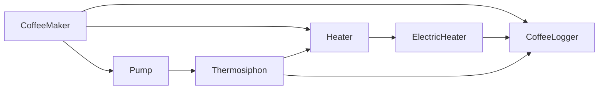

# swift-blade-example

An example app built using [swift-blade](https://github.com/shackley/swift-blade) for dependency injection.

```mermaid
graph LR;
    CoffeeMaker-->CoffeeLogger;
    CoffeeMaker-->Heater;
    CoffeeMaker-->Pump;
    ElectricHeater-->CoffeeLogger;
    Heater-->ElectricHeater;
    Pump-->Thermosiphon;
    Thermosiphon-->CoffeeLogger
    Thermosiphon-->Heater;

```
